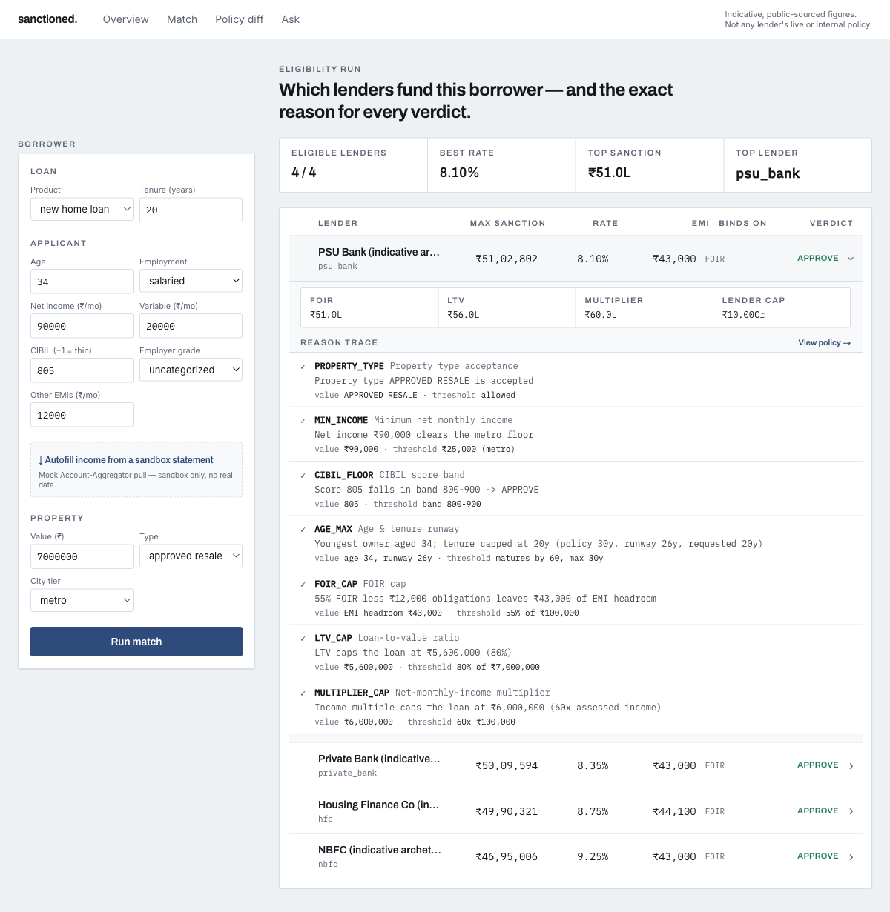
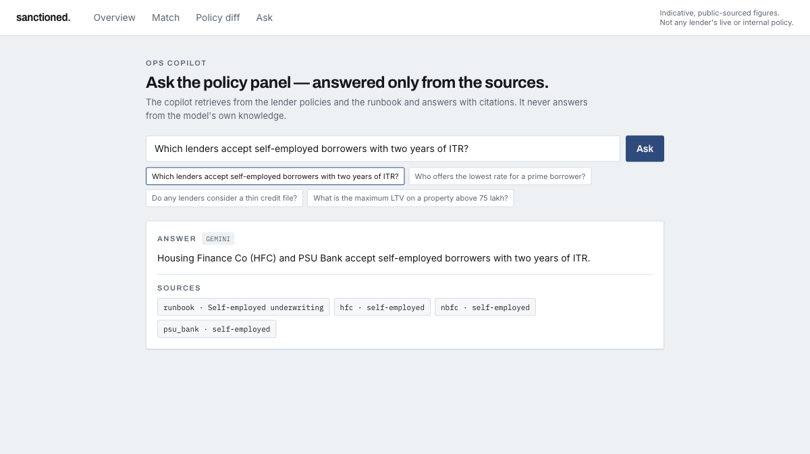
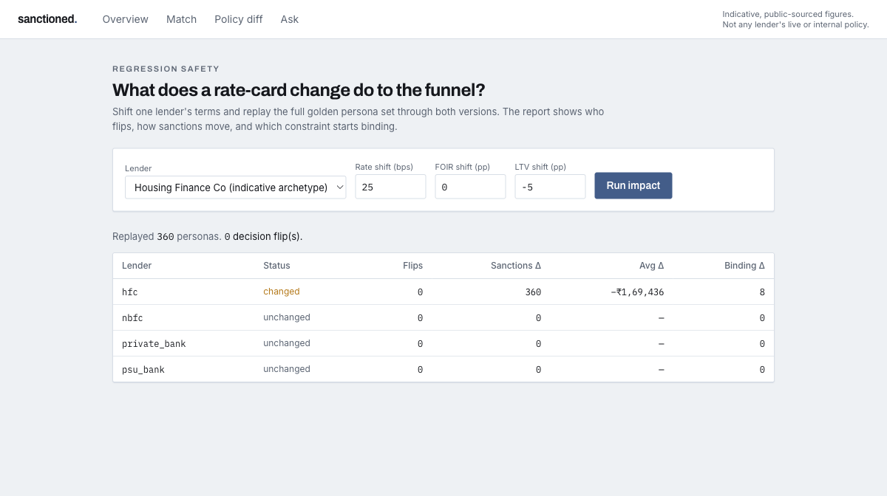

<div align="center">


# sanctioned

### A lender-matching engine that explains every decision.

[](https://github.com/Devanshjoshi2804/Sanctioned/actions/workflows/ci.yml)
[](LICENSE)
[](https://www.python.org/downloads/)
[](https://nextjs.org/)
[](https://github.com/astral-sh/ruff)
[](https://mypy-lang.org/)

Given a borrower, it computes **which lenders will fund them, the maximum sanction, the indicative
rate, and the binding constraint** — deterministically, with no ML — and returns a **line-by-line
reason trace for every verdict.**

[Quickstart](#quickstart) · [Features](#features) · [How it works](#how-it-works) · [Architecture](#architecture) · [AI copilot](#ai-copilot) · [Testing](#quality--testing)

</div>

<p align="center">
  
</p>

<details>
<summary>See the AI copilot and the regression-safety report</summary>

<p align="center">
  
</p>
<p align="center">
  
</p>

</details>

> **Why this exists.** Anyone can wire up a loan calculator. The hard, valuable problem in a
> home-loan marketplace is **lender-policy intelligence**: matching a borrower across a large panel
> *accurately*, *explaining* every yes/no, and changing rate cards *without breaking the funnel*.
> sanctioned treats **explainability and regression-safety as the core engineering problem** — every
> decision carries an auditable reason trace, and every policy change produces a machine-readable
> "who flipped and by how much" report.

## Features

- **Deterministic & explainable** — pure typed rules, no ML, no probabilistic scoring. The same
  borrower always yields the same verdict, and each lender returns a reason trace naming the rule,
  the borrower's value, and the policy threshold.
- **Exact money math** — `Decimal` end to end (EMI and present-value formulas), rounded to whole
  rupees only at output. Never `float` for currency.
- **Three products** — new home loan, balance transfer (with indicative savings), and top-up
  (combined-LTV) — one engine, dispatched per product.
- **Policy-as-code** — each lender is a versioned, declarative YAML validated on load; the engine is
  generic and lenders differ only in data. Four indicative archetypes (PSU bank, private bank, HFC, NBFC).
- **Regression safety** — a 360-persona golden dataset, ten Hypothesis property invariants, Pandera
  feed validation, and a **policy-diff impact report** that CI posts on any policy change.
- **REST API + ops dashboard** — FastAPI over the engine; a Next.js dashboard with the match grid,
  reason-trace ledger, lender dossiers, and an interactive policy-diff explorer.
- **AI copilot** — retrieval-grounded Q&A over the policies and runbook, answering **only from
  sources, with citations** — it cannot invent a rate or a rule.
- **Consent-based ingestion** — pull income and obligations from a bank statement over the
  Account Aggregator framework (Setu), then autofill the borrower.

> [!IMPORTANT]
> **Data accuracy & honesty.** Every lender number is an **indicative, public-sourced
> approximation** — never any lender's live or internal policy. Each policy file carries a `source`
> and a `disclaimer`, and every figure's origin is recorded in
> [`docs/data-sources.md`](docs/data-sources.md). No accuracy metric is fabricated.

## How it works

For each lender, the engine runs the qualifying gates (property, self-employed, minimum income,
CIBIL, age/tenure), derives the indicative rate, then sizes the loan as the **smallest of three
bounds** — FOIR, LTV (self-consistent band), and the NMI multiplier — against the lender cap. The
smallest one is reported as the **binding constraint**. Every gate and bound emits a reason trace,
in evaluation order, and the panel is ranked eligible-first, then by sanction, then by rate.

## Architecture

A `uv` (Python) + `pnpm` (JavaScript) monorepo. Business rules live in exactly one place; every
other component is a thin consumer.

```
packages/
  engine/      sanctioned          — the only home of business rules (schemas, rules, products,
                                      registry, validation, policy-diff, golden personas)
  api/         sanctioned_api       — FastAPI service over the engine
  copilot/     sanctioned_copilot   — retrieval-augmented ops copilot (offline + Gemini backends)
  ingest/      sanctioned_ingest    — Account-Aggregator ingestion (Setu client + mock)
apps/
  dashboard/                        — Next.js ops UI (Tailwind), Playwright E2E
docs/                               — domain reference, runbook, data provenance, deploy, spec
```

| Layer | Choice |
|---|---|
| Engine | Python 3.12 · Pydantic v2 · `Decimal` |
| Quality | Hypothesis · pytest golden/unit · Pandera |
| API | FastAPI + Uvicorn |
| Dashboard | Next.js 14 (App Router) + Tailwind |
| E2E | Playwright |
| Copilot | Retrieval-augmented (offline TF-IDF or Google Gemini) |
| Ingestion | Setu Account Aggregator (sandbox) |
| Tooling | uv · pnpm · ruff · black · mypy `--strict` · GitHub Actions |

## Quickstart

```bash
uv sync                                          # install the Python workspace

# Run the stack
uv run uvicorn sanctioned_api.main:app --reload  # API + OpenAPI docs on :8000
cd apps/dashboard && pnpm install && pnpm dev     # dashboard on :3000

# CLIs
uv run python -m sanctioned                        # engine demo (prints a ranked MatchResult)
uv run python scripts/seed_copilot.py              # copilot demo (set GEMINI_API_KEY for live LLM)
uv run python scripts/policy_diff_report.py --base HEAD --head .   # policy-diff impact report
```

Everything runs without any API keys — the copilot falls back to offline retrieval and AA ingestion
to a labelled mock. See [`.env.example`](.env.example) for the optional Gemini / Setu configuration.

## AI copilot

The copilot retrieves from the lender policies and the ops runbook and answers **only from what it
retrieved, with citations** — it never draws on the model's own knowledge, so it cannot hallucinate
a rate or a rule. It is provider-agnostic: a dependency-free offline retriever by default, and
Google Gemini embeddings + synthesis when `GEMINI_API_KEY` is set.

## Quality & testing

```bash
uv run pytest                                      # unit · integration · property · golden · API
uv run ruff check && uv run black --check .         # lint + format
uv run mypy                                         # strict static typing
cd apps/dashboard && pnpm test:e2e                  # Playwright end-to-end
```

`mypy --strict` across every package, `ruff` and `black` clean, and GitHub Actions runs lint,
type-check, the full suite, and the policy-diff PR comment on every push.

## Guardrails

- No ML or probabilistic scoring anywhere — deterministic rules only.
- No business rule outside the engine package; API, UI, and copilot consume it.
- No `float` for money — `Decimal` end to end.
- Every policy number traceable in `docs/data-sources.md`; every policy file carries a `source` and a `disclaimer`.
- Reason traces are a mandatory part of the output, not optional.

## Documentation

- [`docs/SPEC.md`](docs/SPEC.md) — the full build specification
- [`docs/data-sources.md`](docs/data-sources.md) — provenance for every policy figure
- [`docs/runbook.md`](docs/runbook.md) — ops procedures, FAQ, and the copilot's knowledge base
- [`docs/integrations.md`](docs/integrations.md) — the Gemini copilot and the Setu AA flow
- [`docs/deploy.md`](docs/deploy.md) — deploying the API and dashboard

## License

[MIT](LICENSE).

---

<sub>All lender figures herein are indicative, public-sourced approximations for demonstration only,
and must not be relied upon for an actual lending decision.</sub>
